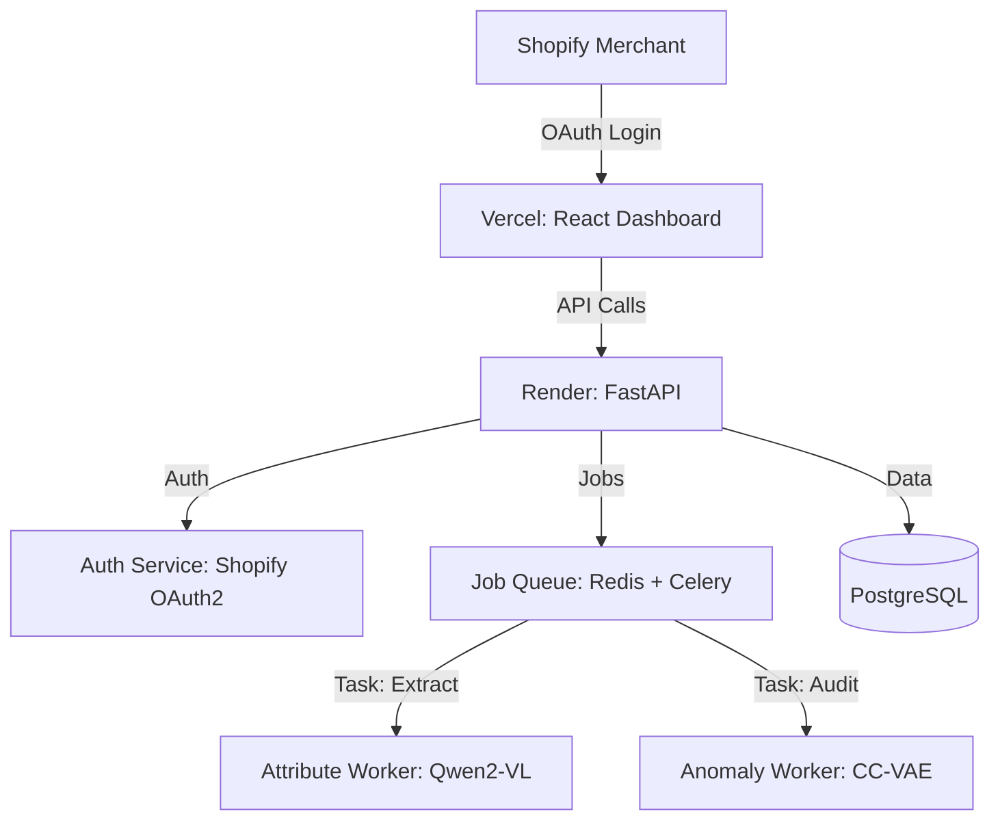

# 🛍️ Catalog AI Suite: Open Source Shopify Automation

> **Automatically extract product attributes and detect visual anomalies in your Shopify catalog using fine-tuned Vision Language Models.**

[](https://opensource.org/licenses/Apache-2.0)
[](https://render.com/deploy?repo=https://github.com/YOUR_USERNAME/catalog-ai-suite)
[](https://YOUR_VERCEL_APP.vercel.app)

## 🚀 What It Does

Stop manually entering product data. Catalog AI connects to your Shopify store, scans your images, and automatically:

1.  **Extracts Attributes:** Brand, Color, Material, Size, Category (using Qwen2-VL).
2.  **Detects Anomalies:** Blurry images, wrong backgrounds, counterfeit signals (using CC-VAE).
3.  **Exports Ready-to-Use CSVs:** Perfect for Amazon, Flipkart, or Odoo listings.

## 🏗️ Architecture

- **Frontend:** React 19 + Vite + TailwindCSS (Hosted on Vercel)
- **Backend:** FastAPI + SQLAlchemy (Hosted on Render)
- **AI Engine:** PyTorch, Qwen2-VL-2B, Custom CC-VAE
- **Queue:** Celery + Redis (Async processing)
- **Database:** PostgreSQL



## ⚡ Quick Start (Local)

Get running in 2 minutes with Docker.

### 1. Clone the repo

```bash
git clone https://github.com/YOUR_USERNAME/catalog-ai-suite.git
cd catalog-ai-suite
```

### 2. Configure Environment

Copy `.env.example` to `.env` and fill in your Shopify credentials.

```bash
cp .env.example .env
# Edit .env with your SHOPIFY_API_KEY and SECRET
```

### 3. Run Everything

```bash
docker-compose up --build
```

### 4. Access

- **Frontend:** http://localhost:5173
- **API Docs:** http://localhost:8000/docs

## ☁️ One-Click Deploy

### Deploy to Render

[](YOUR_RENDER_DEPLOY_LINK)

### Deploy Frontend to Vercel

[](YOUR_VERCEL_DEPLOY_LINK)

## 📖 Features

### Attribute Extraction
- Automatically extracts brand, color, size, material, and category from product images
- Uses fine-tuned Qwen2-VL-2B vision language model
- Outputs structured JSON ready for CSV export
- Supports batch processing of hundreds of products

### Anomaly Detection
- Detects blurry images, wrong backgrounds, and semantic anomalies
- Uses Category-Conditioned VAE (CC-VAE) architecture
- Provides visual heatmaps showing anomaly locations
- Zero-shot detection - no labeled anomaly data required

### Shopify Integration
- One-click OAuth connection to your Shopify store
- Automatic product catalog synchronization
- Real-time extraction job status updates
- CSV export with all extracted attributes

## 🔬 Research

This project powers ongoing research into **Category-Conditioned Variational Autoencoders (CC-VAE)** for e-commerce anomaly detection.

- Read the [Research Proposal](./research/proposal.pdf)
- Target venues: IEEE ICIP / CVPR Workshop
- Dataset: Amazon Berkeley Objects (ABO) + MVTec-AD validation

## 🤝 Contributing

We welcome contributions! See [CONTRIBUTING.md](./CONTRIBUTING.md) for guidelines.

### Development Setup

```bash
# Backend
cd backend
python -m venv venv
source venv/bin/activate  # or venv\Scripts\activate on Windows
pip install -r requirements.txt

# Frontend
cd frontend
npm install
npm run dev
```

## 📄 License

Apache 2.0 — Free for commercial use. Built with ❤️ by [Your Name/Org].

## 💬 Support

- Open an issue for bugs or feature requests
- Join discussions for general questions
- Contact: [your-email@example.com]
